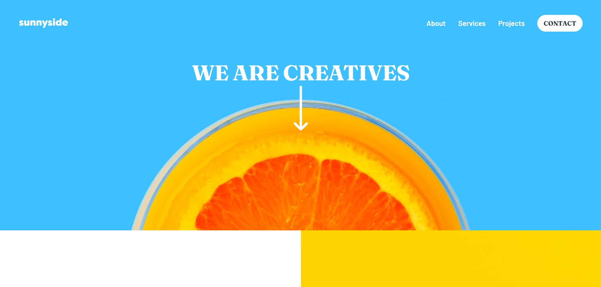

# Frontend Mentor - Sunnyside agency landing page solution

This is a solution to the [Sunnyside agency landing page challenge on Frontend Mentor](https://www.frontendmentor.io/challenges/sunnyside-agency-landing-page-7yVs3B6ef). Frontend Mentor challenges help you improve your coding skills by building realistic projects.

## Table of contents

- [Overview](#overview)
  - [The challenge](#the-challenge)
  - [Screenshot](#screenshot)
  - [Links](#links)
- [My process](#my-process)
  - [Built with](#built-with)
  - [Continued development](#continued-development)
- [Author](#author)

## Overview

### The challenge

Users should be able to:

- View the optimal layout for the site depending on their device's screen size
- See hover states for all interactive elements on the page

### Screenshot

### Links

- Solution URL: [You are already here](https://github.com/Techkie-Creations/sunnyside-agency-landing-page-frontendmentor)
- Live Site URL: [Sunnyside Agency Landing Page Frontend Mentor](https://techkie-creations.github.io/sunnyside-agency-landing-page-frontendmentor)

## My process

### Built with

- Semantic HTML5 markup
- CSS custom properties
- Flexbox
- Grid
- Desktop-first workflow
- [jQuery](https://jquery.com) - JS Library

### Continued development

no further development for this.

## Author

#### Techkie Creations

- Frontend Mentor - [@Techkie-Creations](https://www.frontendmentor.io/profile/Techkie-Creations)
- Codepen - [@Techkie-Creations](https://codepen.io/Tech--Guy)
- LinkedIn - [@stefan-ngago](https://www.linkedin.com/in/stefan-ngago)